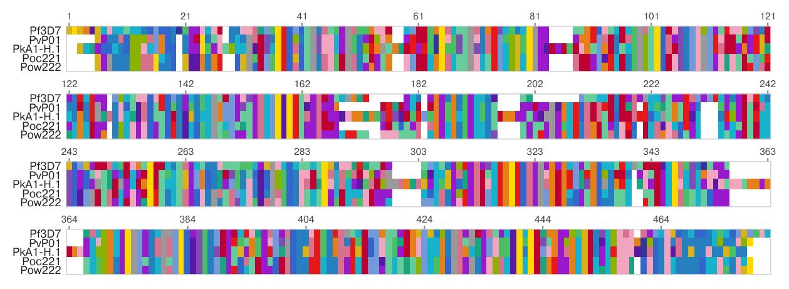

# SeqAlign-plot
Generate publication-ready (Nature formatting standards) visual alignments for nucleotide and amino acid FASTA sequences using Matplotlib and Biopython.

## Features
- **Nature Fonts**: Configures font sizes (5.5–6.5 pt), standard multi-column layout widths (183 mm), Helvetica.
- **Colorblind-Safe Palettes**: Pre-configured high-contrast, accessible palettes for both nucleotide and amino acid alignments.
- **Stacked Block Splitting**: Automatically subdivides long alignments into readable, stacked multi-row blocks with top position rulers.

## Nucleotide alignment:

## Amino acid alignment:

